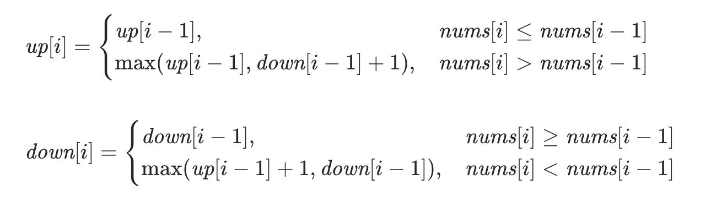

# 🏆leetcode
记录leetcode中的题目🤡
在此文件中更新🧐
<!--more-->
# [134.加油站](https://leetcode-cn.com/problems/gas-station/)
将每个站点进行处理，得到从当前站点至下个站点能够剩余的汽油，可以将此看为一个最长连续子序列的变形。
只要能够找到从一个点出发，一直相加使得和不为0，这样就满足题目所给出的条件。因为还可能存在不满足的情况，所以最后还需要再判断一下。

```
class Solution {
public:
    int canCompleteCircuit(vector<int>& gas, vector<int>& cost) {
      int len = gas.size();
      int start = 0;
      int MAX = 0;
      int now = 0;
      for (int i = 0; i < len; i++) {
        now += (gas[i] - cost[i]);
        if (now < 0) {
          now = 0;
          start = i + 1;
        }
        if (now > MAX) {
          MAX = now;
        }
      }
      MAX = 0;
      for (int i = start; i < len; i++) {
        MAX += gas[i] - cost[i];
        if (MAX < 0)
          return -1;
      }
      for (int i = 0; i < start; i++) {
        MAX += gas[i] - cost[i];
        if (MAX < 0)
          return -1;
      }
      return start;
    }
};

```

# [452. 用最少数量的箭引爆气球](https://leetcode-cn.com/problems/minimum-number-of-arrows-to-burst-balloons/)
dp做法，复杂度n2
将气球按照l,r升序排序，处理从每个气球出发，能够最多引爆多少气球，可以得到一组数列，数列中a[i] 代码从i出发走一步能够跨越的最大距离，对数列进行处理，就可以得到到达最后一个气球所花费最小的步数。

```
class Solution {public:
    int findMinArrowShots(vector<vector<int>>& points) {
      sort(points.begin(), points.end(), [](const vector<int>& a, const vector<int>& b) {
        if (a[0] == b[0])
          return a[1] < b[1];
        else 
          return a[0] < b[0];
      });
      int len = points.size();
      //cout << "len " << len << endl;
      vector<int> l;
      for (int i = 0; i < len; i++) {
        int s = points[i][0];
        int e = points[i][1];
        int num = 1;
        for (int j = i + 1; j < len; j++) {
          if (points[j][0] <= e) {
            s = max(s, points[j][0]);
            e = min(e, points[j][1]);
            num++;
          } else {
            break;
          }
        }
        //cout << "l " << num << endl;
        l.push_back(num);
      }
      vector<int> ans(len + 1, 99999);
      ans[0] = 0;
      //cout << "ans size " << ans.size() << endl;
      for (int i = 0; i < len; i++) {
        for (int j = 1; j <= l[i]; j++) {
          ans[i + j] = min(ans[i + j], ans[i] + 1);
        }
      }
      return ans[len];
    }
};
```


贪心做法，复杂度nlog
将气球按照r升序排序，从第一个气球出发，气球引爆范围包括r的就可以引爆，然后对升序的气球做同样的处理。


```
class Solution {
public:
    int findMinArrowShots(vector<vector<int>>& points) {
      sort(points.begin(), points.end(), [](const vector<int>& a, const vector<int>& b) {
          return a[1] < b[1];
      });
      int len = points.size();
      int ans = 0;
      for (int i = 0; i < len; i++) {
        ans++;
        int now = points[i][1];
        while(i < len && points[i][0] <= now) {
          i++;
        }
        i--;
      }
      return ans;
    }
};

```

# [222. 完全二叉树的节点个数](https://leetcode-cn.com/problems/count-complete-tree-nodes/)
二分查找
```
/**
 * Definition for a binary tree node.
 * struct TreeNode {
 *     int val;
 *     TreeNode *left;
 *     TreeNode *right;
 *     TreeNode(int x) : val(x), left(NULL), right(NULL) {}
 * };
 */class Solution {public:
    int countNodes(TreeNode* root) {
      int h = 0;
      TreeNode* tmp = root;
      while(tmp != nullptr) {
        h++;
        tmp = tmp -> left;
      }

      int ans = pow(2, h - 1) - 1;
      tmp = root;
      for (int i = 1; i <= h; i++) {
        TreeNode* p = tmp;
        if (tmp != nullptr)
        if (f(p, h - i)) {
          tmp = tmp -> right;
          ans += pow(2, h - 1 - i) + 0.5;
        } else {
          tmp = tmp -> left;
        }
      }
      return ans;
    }
    bool f(TreeNode* tmp, int h) {
      if (h == 0) {
        return tmp != nullptr;
      }
      tmp = tmp -> right;
      for (int i = 1; i < h; i++) {
        tmp = tmp -> left;
      }
      return tmp != nullptr;
    }
};
```

暴力递归
```
/**
 * Definition for a binary tree node.
 * struct TreeNode {
 *     int val;
 *     TreeNode *left;
 *     TreeNode *right;
 *     TreeNode(int x) : val(x), left(NULL), right(NULL) {}
 * };
 */
class Solution {
public:
    int countNodes(TreeNode* root) {
      if (root == nullptr) {
        return 0;
      }
      return countNodes(root -> left) + countNodes(root -> right) + 1;
    }
};
```


# [1370. 上升下降字符串](https://leetcode-cn.com/problems/increasing-decreasing-string/)
统计每个字符出现的次数，然后从头到尾，从尾到头扫描，直至所有字符都被输出

```
class Solution {
public:
    string sortString(string s) {
        vector<int> v(26,0);
        int len = s.length();
        for (int i = 0; i < len; i++) {
          v[s[i] - 'a']++;
        }
        string ans = "";
        while(len) {
          for (int i = 0; i < 26; i++) {
            if (v[i] > 0) {
              v[i]--;
              ans += char('a' + i);
              len--;
            }
          }
          for (int i = 25; i >= 0; i--) {
            if (v[i] > 0) {
              v[i]--;
              ans += char('a' + i);
              len--;
            }
          }
        }
        return ans;
    }
};

```

# [164. 最大间距](https://leetcode-cn.com/problems/maximum-gap/)
1. 暴力排序，然后遍历(nlogn)
2. 将数组划分为不同的区间，每块区间的长度为（MAX - MIN)/(n - 1）,然后遍历相邻的区间，用后面区间的最小值 - 前面区间的最大值，最终ans为所有差中的最大值

    ```
    class Solution {
public:
    int maximumGap(vector<int>& nums) {
      int len = nums.size();
      if (len < 2)
        return 0;
      int Max = *max_element(nums.begin(), nums.end());
      int Min = *min_element(nums.begin(), nums.end());
      int d = max(1, (Max - Min) / (len - 1));
      int bucketSize = (Max - Min) / d + 1;
      vector<pair<long long, long long>> v(bucketSize, {999999999, -1});
      for (int i = 0; i < len; i++) {
        int index = (nums[i] - Min) / d;
        v[index].first = min(v[index].first, nums[i] * 1ll);
        v[index].second = max(v[index].second, nums[i] * 1ll);
      }
      long long ans = 0;
      int pre = -1;
      for (int i = 0; i < bucketSize; i++) {
        if (v[i].second == -1)
          continue;
        if (pre != -1 ) {
           ans = max(ans, v[i].first - v[pre].second);
        }
        pre = i;
      }
      return ans;
    }
};
```
# [454. 四数相加 II](https://leetcode-cn.com/problems/4sum-ii/)
1.将AB，CD分别处理成两个单独的vector，然后排序，转换为两数相加
```
class Solution {
public:
    int fourSumCount(vector<int>& A, vector<int>& B, vector<int>& C, vector<int>& D) {
      int len = A.size();
      vector<int> a;
      vector<int> b;
      for (int i = 0; i < len; i++) {
        for (int j = 0; j < len; j++) {
          a.push_back(A[i] + B[j]);
          b.push_back(C[i] + D[j]);
        }
      }
      sort(a.begin(), a.end());
      sort(b.begin(), b.end());

      len = a.size();
      //cout <<  "len " << len << endl;
      int s = 0;
      int e = len - 1;
      int ans = 0;
      while(s < len || e >= 0) {
        //cout << "s " << s << "  e " << e << endl;
        int now = a[s] + b[e];
        if (now == 0) {
          int tmp = a[s];
          int l1 = 0, l2 = 0;
          while(s < len && a[s] == tmp) {
            s++;
            l1++;
          }
          tmp = b[e];
          while(e >= 0 && b[e] == tmp) {
            e--;
            l2++;
          }
          ans += l1 * l2;
        } else if(now < 0) {
          s++;
        } else {
          e--;
        }
        //cout << "ans1 " << ans << endl;
        if (s == len) {
          while(e >= 0) {
            now = a[len - 1] + b[e];
            if (now == 0) {
              ans++;
              e--;
            }
            if (now < 0) {
              break;
            }
          }
          break;
        }

        if (e < 0) {
          while(s < len) {
            now = a[s] + b[0];
            if (now == 0) {
              ans++;
              s++;
            }
            if (now > 0) {
              break;
            }
          }
          break;
        }
      }
    return ans;
  }
};
```
2.对AB，CD分别进行处理，存在map中
```
class Solution {
public:
    int fourSumCount(vector<int>& A, vector<int>& B, vector<int>& C, vector<int>& D) {
        unordered_map<int, int> countAB;
        for (int& u: A) {
            for (int& v: B) {
                countAB[u + v]++;
            }
        }
        int ans = 0;
        for (int& u: C) {
            for (int& v: D) {
                if (countAB.count(-u - v)) {
                    ans += countAB[-u - v];
                }
            }
        }
        return ans;
    }
};
``` 

# [5615. 使数组互补的最少操作次数](https://leetcode-cn.com/problems/minimum-moves-to-make-array-complementary/)

首先很容易想到的一个点是去遍历所有的可能[2, 2 * limit],然后去判断每一对的和为X时，最少的操作次数为多少。
对于每一对数的和变为X需要的操作次数，取一对数中较小的数为a, 较大的数为b，再加上a+b, 我们可以得到5个点，分别为2, a + 1, a + b, b + limit, 2 * limit。
X的取值范围 与 一对数的和变为X的关系为:
[2, a + 1) : 2
[a, a + b) : 1
[a + b, a + b] : 0
[a + b + 1, b + limit] : 1
[b + limit + 1, 2 * limit) : 2
所以当确定X之后，我们便能很快的求得一对数的和变为X的操作数。
如果暴力遍历[2, 2 * limit]去判断的话，复杂度为O(n2)，很明显会超时。
下面就是如何在一部分去优化复杂度。
这里可以类比题目[452. 用最少数量的箭引爆气球](https://leetcode-cn.com/problems/minimum-number-of-arrows-to-burst-balloons/)，我们是可以得到最终的结果一定是不会是一个区间的中间值，一定是所有的（a, a + b, a + b + 1, b + limit + 1）中存在的，所以我们可以将搜索范围缩小至所有的（a, a + b, a + b + 1, b + limit + 1）中。

但是所有的（a, a + b, a + b + 1, b + limit + 1）中的个数是有可能与2 * limit相近的，直接去遍历所有出现过的点，复杂度没有降下来。
下面我们去判断针对一对数的情况，在不同的区间，一对数的和变为X的操作数k是怎么变化的，我们参考上面提到的 **X的取值范围 与 一对数的和变为X的关系**
设X的取值开始为2，k也为2
然后增大为a时，k为1
然后增大为a + b时， k为0
然后增大为a + b + 1时， k为1
然后增大为b + limit + 1时，k为2

对于一组数我们可以得到这样的变化特性，我们可以将多对数的这些数字叠加起来，将**迭代判断转化为线性变化扫描**，这样将复杂度降到O(n)

```
class Solution {
public:
    int minMoves(vector<int>& nums, int limit) {
      int len = nums.size();
      map<int, int> m;
      for (int i = 0; i < len / 2; i++) {
        int Min = min(nums[i], nums[len - 1 - i]);
        int Max = max(nums[i], nums[len - 1 - i]);
        int l = Min + 1;
        int r = Max + limit;
        int sum = nums[i] + nums[len - 1 - i];
        m[l]--;
        m[sum]--;
        m[sum + 1]++;
        m[r + 1]++;
      }
      int ans = 999999;
      int now = len;
      for (auto &s : m) {
        now += s.second;
        ans = min(ans, now);
      }
      return ans;
    }
};
```

# [1673. 找出最具竞争力的子序列](https://leetcode-cn.com/problems/find-the-most-competitive-subsequence/)
最容易想到的一种方法是，在[0,len-k+1)个数中找到最小的（设最小的数下标为l1），然后即为ans的第一个数，然后从[l1 + 1, len-k + 2)中找到最小的，然后依次循环，直到找到k个数。
这样复杂度为O(n2)

可以使用单调栈来优化复杂度，首先对前len-k+1个数进行处理，得到单调递增的栈，然后再依次处理剩下的k-1个数，注意最终单调栈中的数字个数必须大于等于k

在此代码中利用双向队列去实现单调栈

```
class Solution {
public:
    vector<int> mostCompetitive(vector<int>& nums, int k) {
      deque<int> v;
      int len = nums.size();
      for (int i = 0; i < len - k + 1; i++) {
        while (!v.empty() && nums[i] < v.back()) {
          v.pop_back();
        }
        v.push_back(nums[i]);
      }

      vector<int> ans;
      int lsum = v.size() - 1;

      for (int i = len - k + 1; i < len; i++) {
        while(lsum > 0 && nums[i] < v.back()) {
          v.pop_back();
          lsum--;
        }
        v.push_back(nums[i]);
      }

      for (int i = 0; i < k; i++) {
        ans.push_back(v[i]);
      }
      return ans;

    }
};
```


# 842. 将数组拆分成斐波那契序列
因为数据最长只有200，又因为数字的范围在int范围内，所以我们可以暴力一点。
用循环来枚举出数列的前两项，然然后再依次判断是否可以构成数列。

```class Solution {
public:
    vector<int> splitIntoFibonacci(string S) {
      int len = S.length();
      vector<int> ans;
      if (len < 3)
        return vector<int>(0);
      for (int i = 1; i < len - 2 && i < 12; i++) {
        for (int j = i + 1; j < len - 1 && j - i < 12; j++) {
          ans.clear();
          string s1 = S.substr(0, i);
          string s2 = S.substr(i, j - i);
          long long num1 = b(s1);
          long long num2 = b(s2);
          //cout << "num1 " << num1 << " num2 " << num2 << endl; 
          if (num1 == -1 || num2 == -1) {
            continue;
          }
          ans.push_back((int)num1);
          ans.push_back((int)num2);
          
          bool flag = true;
          int now = j;
          while(now < len && flag) {
            long long num3 = num1 + num2;
            //cout << "num3 " << num3 << endl;
            if (num3 >= (1ll<<32)) {
              flag = false;
              break;
            }
            int ll = l(num3);
             //cout << "l num3 " << num3 << endl;
            if (now + ll - 1 >= len) {
              flag = false;
              break;
            }
            string s3 = S.substr(now, ll);
            if (b(s3) != num3) {
              flag = false;
              break;
            }
            ans.push_back((int)num3);
            num1 = num2;
            num2 = num3;
            now = now + ll;
          }
          
          if (!flag) {
            continue;
          }
          if (now >= len) {
            return ans;
          }
          
        }
      }
      return vector<int>(0);
    }
    long long f(string& s) {
      long long ans = 0;
      for (auto c : s) {
        ans = ans * 10 + int(c - '0');
      }
      return ans;
    }
    long long b(string& s) {
      int len = s.length();
      if (len > 1 && s[0] == '0') {
        return -1;
      }
      long long tmp = f(s);
      if (tmp >= 0 && tmp <= (1ll<<32 - 1)) {
        return tmp;
      } else {
        return -1;
      }
    }
    int l(long long x) {
      if(x == 0)
        return 1;
      int ans = 0;
      while(x) {
        ans++;
        x /= 10;
      }
      return ans;
    }
};

```

# [649. Dota2 参议院](https://leetcode-cn.com/problems/dota2-senate/)
用list处理一下就行，之前很少用到list，这次熟悉了一次。


```class Solution {
public:
    string predictPartyVictory(string senate) {
      int suma = 0;
      int sumb = 0;
      string aa = "Radiant";
      string bb = "Dire";

      list<char> l;
      for (auto c : senate) {
        if (c == 'R') {
          suma++;
        } else {
          sumb++;
        }
        l.push_back(c);
      }

      int a = 0, b = 0;
      int nowa = 0, nowb = 0;
      while(nowa < suma && nowb < sumb) {
        for(auto it = l.begin(); it != l.end(); it++) {
          //cout << *it << endl;
          if (*it == 'R') {
            if (a > 0) {
              it = l.erase(it);
              it--;
              nowa++;
              a--;
            } else {
              b++;
            }
          } else {
            if (b > 0) {
              it = l.erase(it);
              it--;
              nowb++;
              b--;
            } else {
              a++;
            }
          }
        }
      }

      if(nowa == suma) {
        return bb;
      } else {
        return aa;
      }
      
    }
};
```

# [376. 摆动序列](https://leetcode-cn.com/problems/wiggle-subsequence/)

构建状态转移方程式，二维的dp数组，dp[i][0]代表i之前的最后为升序的最长长度，dp[i][1]代表i之前的最后为降序的最长长度。

最后也可以减少空间复杂度
```
class Solution {
public:
    int wiggleMaxLength(vector<int>& nums) {
      if (nums.size() == 0)
        return 0;
      int up = 1;
      int down = 1;
      for (int i = 1; i < nums.size(); i++) {
          if (nums[i] > nums[i - 1]) {
            up = max(down + 1, up);
          } else if (nums[i] < nums[i - 1]) {
            down = max(up + 1, down);
          }
      }
      return max(up, down);
    }
};
```