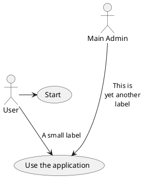
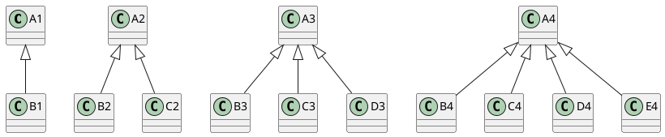
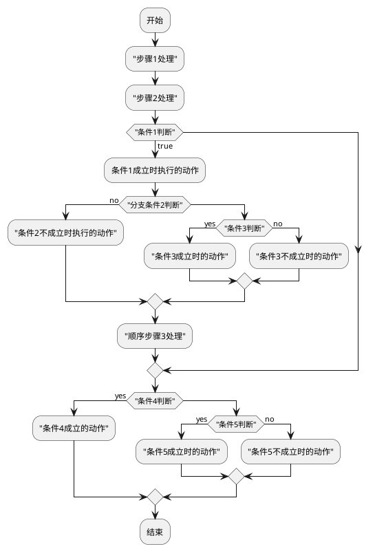
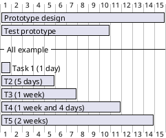
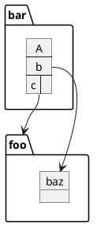
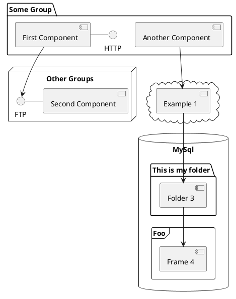
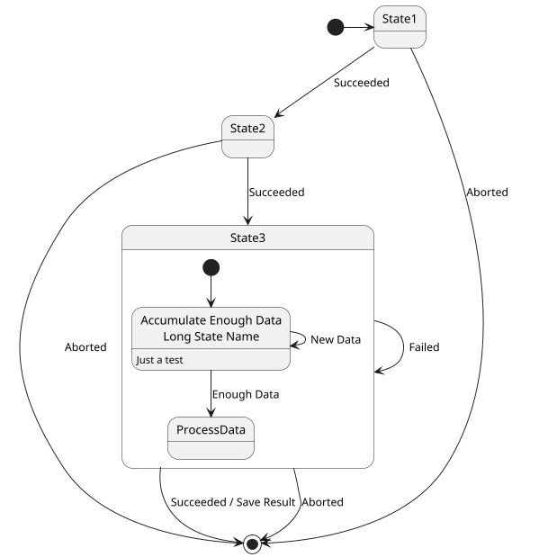
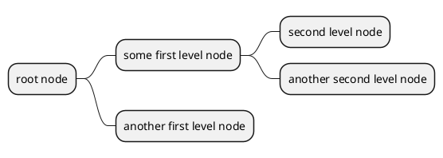
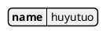
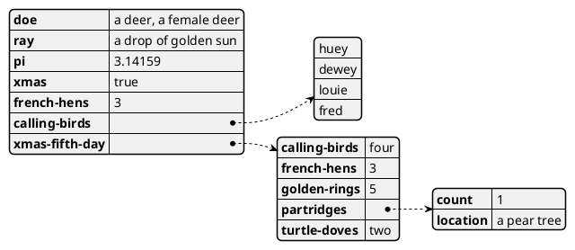

## plantuml

### 时序图
```puml
a->b
a->c
c-->b
```
### 用例图

```puml
@startuml

User -> (Start)
User --> (Use the application) : A small label

:Main Admin: ---> (Use the application) : This is\nyet another\nlabel

@enduml
```
<!--more-->

### 类图

```puml
@startuml
skinparam groupInheritance 1

A1 <|-- B1

A2 <|-- B2
A2 <|-- C2

A3 <|-- B3
A3 <|-- C3
A3 <|-- D3

A4 <|-- B4
A4 <|-- C4
A4 <|-- D4
A4 <|-- E4
@enduml
```

### 流程图

```puml
@startuml
:开始;
:"步骤1处理";
:"步骤2处理";
if ("条件1判断") then (true)
    :条件1成立时执行的动作;
    if ("分支条件2判断") then (no)
        :"条件2不成立时执行的动作";
    else
        if ("条件3判断") then (yes)
            :"条件3成立时的动作";
        else (no)
            :"条件3不成立时的动作";
        endif
    endif
    :"顺序步骤3处理";
endif

if ("条件4判断") then (yes)
:"条件4成立的动作";
else
    if ("条件5判断") then (yes)
        :"条件5成立时的动作";
    else (no)
        :"条件5不成立时的动作";
    endif
endif
:结束;
@enduml
```

### 甘特图

```puml
@startgantt
[Prototype design] lasts 15 days
[Test prototype] lasts 10 days
-- All example --
[Task 1 (1 day)] lasts 1 day
[T2 (5 days)] lasts 5 days
[T3 (1 week)] lasts 1 week
[T4 (1 week and 4 days)] lasts 1 week and 4 days
[T5 (2 weeks)] lasts 2 weeks
@endgantt
```

### 对象图

```puml
@startuml
package foo {
    object baz
}

package bar {
    map A {
        b *-> foo.baz
        c =>
    }
}

A::c --> foo
@enduml
```

### 组件图

```puml
@startuml

package "Some Group" {
  HTTP - [First Component]
  [Another Component]
}

node "Other Groups" {
  FTP - [Second Component]
  [First Component] --> FTP
}

cloud {
  [Example 1]
}


database "MySql" {
  folder "This is my folder" {
    [Folder 3]
  }
  frame "Foo" {
    [Frame 4]
  }
}


[Another Component] --> [Example 1]
[Example 1] --> [Folder 3]
[Folder 3] --> [Frame 4]

@enduml
```

### 状态图

```puml
@startuml
scale 600 width

[*] -> State1
State1 --> State2 : Succeeded
State1 --> [*] : Aborted
State2 --> State3 : Succeeded
State2 --> [*] : Aborted
state State3 {
  state "Accumulate Enough Data\nLong State Name" as long1
  long1 : Just a test
  [*] --> long1
  long1 --> long1 : New Data
  long1 --> ProcessData : Enough Data
}
State3 --> State3 : Failed
State3 --> [*] : Succeeded / Save Result
State3 --> [*] : Aborted

@enduml
```

### 思维导图

```puml
@startmindmap
* root node
	* some first level node
		* second level node
		* another second level node
	* another first level node
@endmindmap
```

### json

```puml
@startjson
{
  "name" : "huyutuo"
}
@endjson
```

### yaml

```puml
@startyaml
doe: "a deer, a female deer"
ray: "a drop of golden sun"
pi: 3.14159
xmas: true
french-hens: 3
calling-birds: 
	- huey
	- dewey
	- louie
	- fred
xmas-fifth-day: 
	calling-birds: four
	french-hens: 3
	golden-rings: 5
	partridges: 
		count: 1
		location: "a pear tree"
	turtle-doves: two
@endyaml
```

